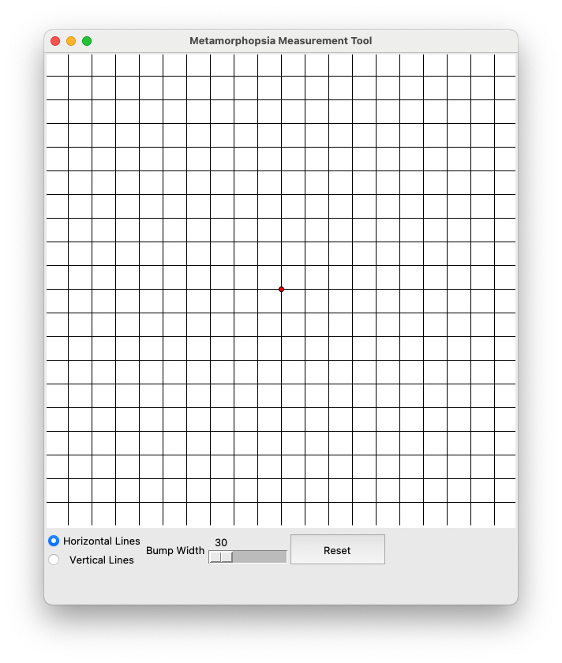
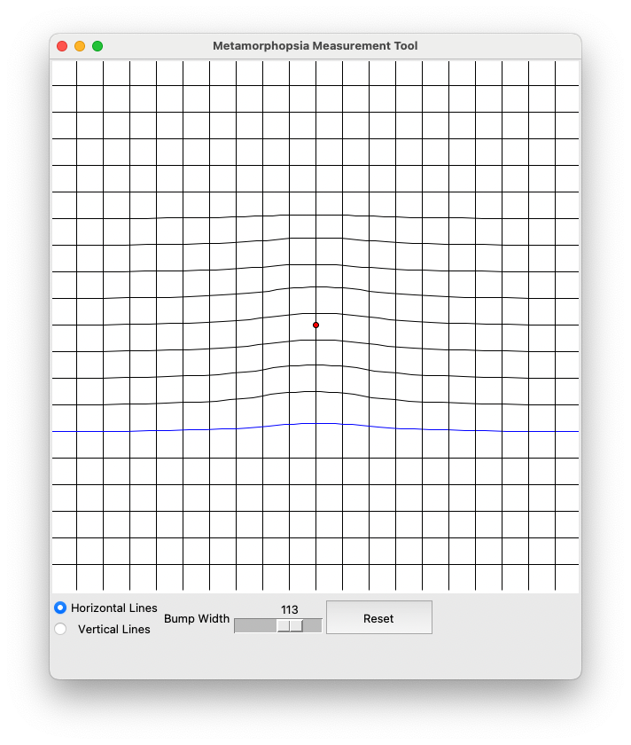

# metamorphopsia.py

An open Python tool for assessing Metamorphopsia caused by an epiretinal membrane (ERM)

I have an ERM in my right eye, and at the end of a recent examination, I was given an Amsler chart to take home, to use for self assessment of the amount of distortion. With the the words *if it gets worse, come back and see us. If not, see you in a year*.

The *Amsler Recording Chart*, is just an A5 sheet of paper with a 5mm pitch grid printed on it and a dot in the middle. When you look at it with one eye (staring at the dot) you see distortion in the grid. For me, the horizontal lines bend near the middle.

On the way home from the opticians, I started thinking about how this self-assessment could be done in a more quantitative manner.

The result of this is a prototype software tool that I can use to record my metamorphopsia. 

# Installation

The code is pure Python 3, and needs the following modules, that I think are part of most Python distributions:

* Tkinter
* PIL

I have only tested it on Mac OS. But it should be fine on any platform.

# Use

The program is pretty simple, all contained in a single Python file. You can run it like this:

```
python3 metamorphopsia.py
```

This will open a window looking like this.



The process with my software tool is, while looking at the grid with the eye you want to assess (let's call this the *bad eye*), adjust the lines until they appear straight, with the bad eye. In doing this, you will have distorted the grid, to compensate for the distortion in the bad eye. When you look at the grid with your good eye, you will see the distorted grid, that you can save it as a record.

Here's the grid that looks regular for me using my bad eye.



In more detail, here is the procedure.
* Decide which lines to adjust first (horizontal or vertical) and click the relevant radio button for *Horizontal Lines* or *Vertical Lines*. If like me, the vertical lines are straight, then you will only need to adjust the horizontal lines.
* Closing your good eye, look at the dot in the centre of the grid (the grid lines look bumpy). Try and keep a consistent distance to the screen.
* Use your mouse (or get someone else to do this) to drag the middle line on which the red dot is placed so that it is as straight as possible.
* You may find that while the middle of the distortion is corrected, the corrective bump is not wide enough. If so, adjust the *Bump Width* slider, until the middle line is as straight as possible. All the time, try and focus on the dot.
* Now adjust the lines above and below the middle line, to make them flat, always coming back to focus on the dot.
* If you need to adjust the lines on the other axis, click the radio button and repeat the line straightening for the other axis.

That's it. You can now *Save* the chart, from the *File* menu. By default, the file is named as a timestamp, so you can keep a historical record.


Saving, saves the chart as data, so, you can if you want re-open it and edit an old chart, before saving it again. 

The *Export...* menu option allows you to save the plot as a PNG image.

# Caveat

I have zero optometry training. I can barely spell it. So please, please, please **DO NOT RELY ON THIS TOOL**. Go and see a professional.

I am very aware that this works for me, as my distortions are only along horizontal lines. And essentially I have a single distortion 'bump', that extends to several lines above and below the dot. And, imaging the distortion may be on different axes for different people.

I don't know how useful this tool will be for someone with a *diagonal* distortion.

I'd love to enter into a discussion on this with an optometrist, and welcome pull requests for improvements. If you have found the tool useful, please send me a message via github.

